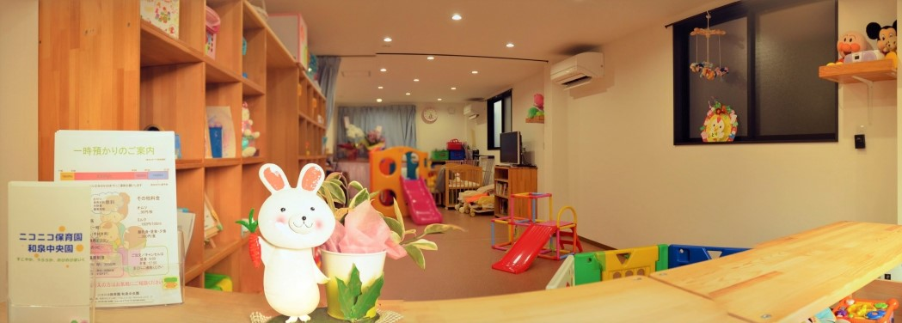
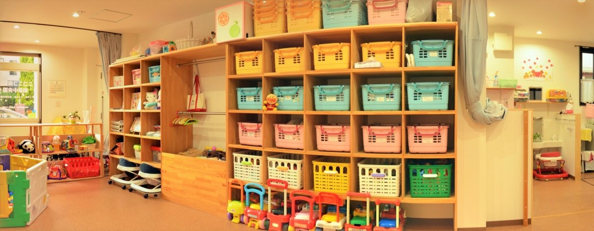
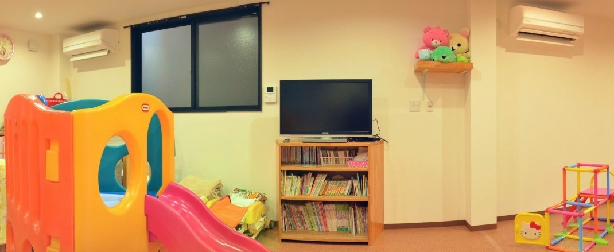

## 園内の様子

<!-- 2016年11月に引っ越してきました 🏠 -->

<!-- [〒594-1105 和泉市のぞみ野三丁目1237-58 Shima.B.L.D.G 1F](https://goo.gl/maps/Cu987BXSnYU2) -->

<!--  -->

<!--  -->

<!--  -->

_entrance_

<!-- <em>entrance</em> -->

_locker_

_space_

<!-- #### entrance -->

<!-- 一言 -->

<!-- #### locker -->

<!-- 一言 -->

<!-- #### space -->

<!-- 一言 -->

保育士が見当たらない場合には、インターフォンでお知らせください 🙇

<!--  -->

---

## 1 日のスケジュール

<!--  -->

空いている時間帯は主に遊んでいます。季節感のある遊びなど、その時々に応じてする遊びが決まります。また、お散歩に出かけることも多いです。

#### 定番のお散歩コース Google My Map

* oge
  * 風がいい
* few
  * 遊具が充実している

---

## 1 年のスケジュール

<!--  -->

<!-- 
 -->

日々の模様は**ほいくダイヤリー**に随時アップしております。合わせて是非ご覧ください。

<!-- | time  |   do   |
|  :--: |  :--   |
| 7:00  |順次登園|
|  ⋮   |不定    |
| 9:30  |授乳    |
| 10:00 |設定保育|
| 11:30 |昼食    |
| 13:00 |お昼寝  |
|  ⋮   |不定    |
| 15:00 |おやつ  |
|  ⋮   |不定    |
| 17:00 |順次降園|
| 18:00 |夕食    | -->
