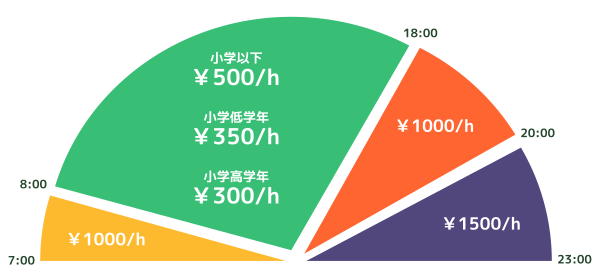

# 一時預かり

### 持ち物

1. ミルク/哺乳瓶
1. 食事用エプロン
1. スタイ(幼児のみ)
1. ハンドタオル
1. オムツ
1. おしりナップ
1. 健康保険証のコピー
1. 着替えの服一式

#### オプション

|type|price|note|
|:--:|:--:|:--|
|オムツ|￥90/枚||
|ミルク|￥180/100ml||
|ごはん|￥300/食|ご注文・キャンセルは 昼食 9:00 夕食 17:00 までにご連絡ください|

## 料金

ご利用は30分単位から可能です😼  
20:00 ~ 23:00 のご利用は**前日までの予約が必要**となります。

### 1日保育パック

1日保育パックをご利用頂くと、9:00 ~ 17:00 (8時間) が割安になります。

|age|price|
|:--:|:--:|
|小学以下|￥3000|
|小学低学年|￥2400|
|小学高学年|￥2100|

※時間超過の場合、通常の料金+延長分にてお支払い頂きます。あらかじめご了承ください。

***

明細な金額については**一時預かりシミュレーション**をご活用ください。

持ち物や料金に関わらず、ご不明な点等がございましたらお気軽にご相談ください。