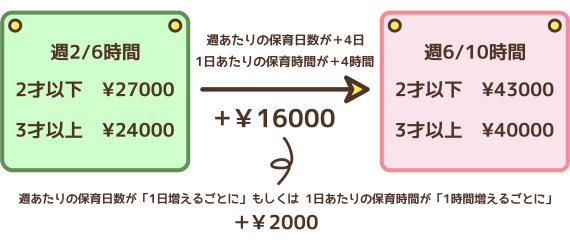

# 月極保育

兄弟姉妹でのご入園の際には**上のお子さまの入園料と保育料は半額となります**😺

##### 入園料
￥5000

##### 月毎の料金
|type|price|note|
|:--|:--|:--|
|諸経費|￥200||
|給食費|￥300 × days|ご希望の場合|
|保育料|￥????|以下図|
|早朝料金|￥3000|7:00~8:00をご利用の場合|
|夜間料金|￥3000|18:00以降をご利用の場合|
|日曜料金|￥3000|日曜日をご利用の場合|

##### 保育料:

### 毎日の持ち物

1. ハンドタオル
2. 食事用エプロン
3. スタイ(幼児のみ)
4. 連絡ノート(1冊目は当園が用意)

### お預かりする物

1. 歯ブラシ/コップ
2. ミルク/哺乳瓶
3. オムツ
4. 着替えの服一式
5. 母子手帳のコピー
6. 健康保険証のコピー
7. お昼寝用バスタオル(夏季のみ)

***

明細な金額については**月極保育シミュレーション**をご活用ください。

持ち物や料金に関わらず、ご不明な点等がございましたらお気軽にご相談ください。
